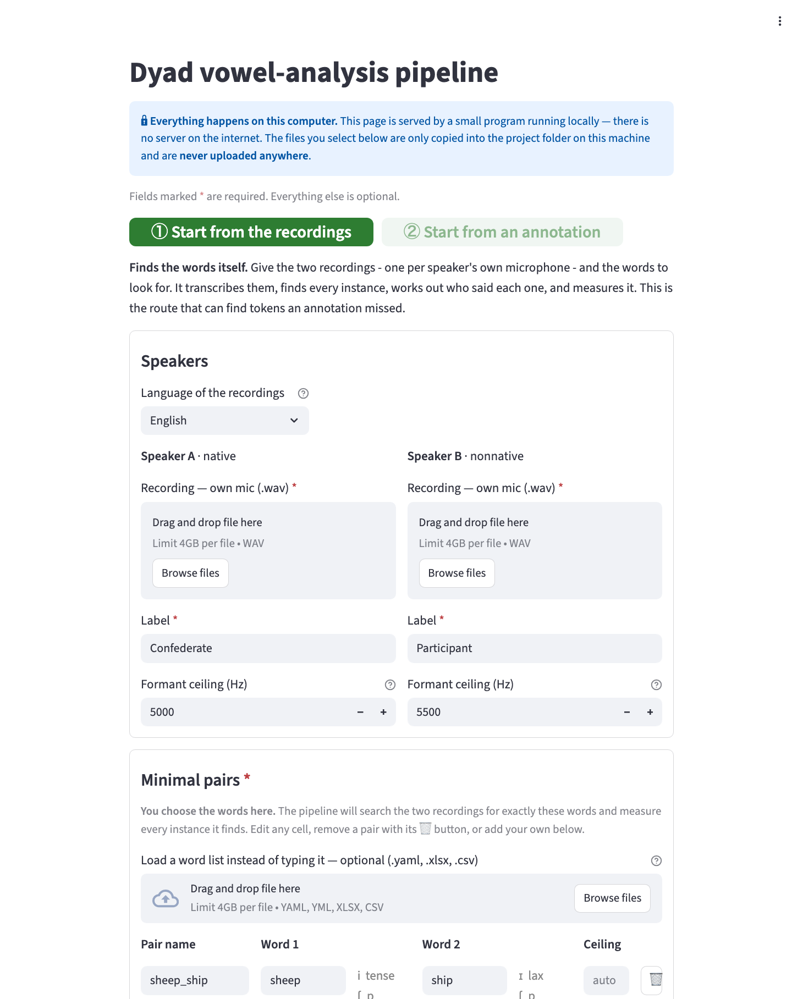

# Automatic acoustic analysis of dyadic conversation

[](https://doi.org/10.5281/zenodo.23045187)

An open-source Python pipeline that finds, segments and measures target words
in unscripted two-speaker conversations, replacing manual annotation in Praat.

Given two audio recordings — one microphone per speaker — it transcribes them,
locates every instance of the target words, works out from the audio alone
which speaker produced each one, segments the word and its vowel, and measures
F1, F2 and duration. Cases it is unsure about are flagged to indicate that a
manual check is needed.

**No programming or Python skills are needed**, and no previous experience with
Praat is assumed. There is a browser app that starts by double-clicking, and
the command-line route is a single command.



*Pick the two recordings, list the words, press Run. The second tab measures
words that have already been annotated, and needs only one recording.*

It was built for studying native–nonnative phonetic adaptation over English
tense–lax vowel contrasts (*sheep–ship*, *pool–pull*, *dock–duck*), but nothing
in the design is specific to those words or to English.

---

## Requirements

- **Python 3.9 or newer.** That is all — Praat arrives with the Install step
  below, so the Praat application is not needed.
- **Two `.wav` files**, one per speaker's own microphone. Both microphones will
  pick up both speakers; the pipeline handles that.
- **Single-syllable target words**, and a language the recogniser knows:
  `en` (English), `da` (Danish) or `ja` (Japanese).

## Install

**macOS / Linux**
```bash
git clone https://github.com/SaraGina/conversational-vowel-analysis.git
cd conversational-vowel-analysis/Scripts
python3 -m venv venv
./venv/bin/pip install -r requirements_asr.txt
```

**Windows**
```
git clone https://github.com/SaraGina/conversational-vowel-analysis.git
cd conversational-vowel-analysis\Scripts
py -m venv venv
venv\Scripts\pip install -r requirements_asr.txt
```

The first run downloads the speech-recognition model (about 1.5 GB, once).

## Run it

### Option A — the browser app

Double-click **`Start Dyad App`** in `Scripts/` (`.command` on macOS, `.bat` on
Windows). The first launch installs everything by itself and then opens the
browser. Select the two recordings, adjust the word list, and press
**Run pipeline**.

On macOS the first launch may be blocked: right-click → Open.

### Option B — the terminal

Copy `Scripts/example_dyad.yaml` to a new file, edit it, and run:

```bash
cd Scripts
./run_dyad my_dyad.yaml         # macOS / Linux
run_dyad.bat my_dyad.yaml       # Windows
```

A minimal config:

```yaml
language: en

speaker_A:
  audio: speakerA.wav           # place in Input/
  label: Confederate
  max_formant: 5000             # ~5000 Hz lower voices, ~5500 Hz higher
speaker_B:
  audio: speakerB.wav
  label: Participant
  max_formant: 5500

pairs:
  sheep_ship: [sheep, ship]
  pool_pull:  [pool, pull]
```

Transcription takes roughly 10 minutes per 50 minutes of audio, once per
recording. Everything runs locally; no audio leaves the machine.

### Option C — measure words that are already annotated

A study already annotated by hand can skip the first three stages: name an
annotation Excel in the config and the pipeline reads the word list from it
and measures. One recording is enough, since the annotation already says who
spoke. See [DOCUMENTATION.md](DOCUMENTATION.md).

## What comes out

Written to `Output/`:

- `<dyad>_ALL_sets_analysis.xlsx` — one row per measured token, with onset and
  offset, word and vowel duration, F1 and F2 in Hz and Bark, the speaker, and
  the quality flags
- `TextGrids_SYSTEM/` — one Praat TextGrid per speaker, with word and vowel tiers
- `COMPARISON_system_vs_human.xlsx` — a colour-coded comparison against a manual
  annotation, if one is supplied

---

## Everything else

**[DOCUMENTATION.md](DOCUMENTATION.md)** covers the rest: every config setting,
the quality flags and what to do about them, `master_vocab.csv`, how the seven
stages work, how to add a language, and the known limitations.

## A note on the data

This repository contains **code only**. The conversational recordings this
pipeline was developed on, and the measurement tables derived from them, are
personal data under the GDPR and are not distributed here. There is no sample
audio; the pipeline runs on recordings supplied by the user.

Trying it out takes two `.wav` files from a single conversation, one per
speaker's own microphone, and a list of the words to be measured.

## Citing

    https://doi.org/10.5281/zenodo.23045187

That DOI always resolves to the most recent version. Each release also has its
own: version 1.0.0 is `10.5281/zenodo.23045188`.

Full author list and the conference abstract are in `CITATION.cff`, which
GitHub's "Cite this repository" button reads.

## License

MIT — see `LICENSE`.

The bundled pronunciation dictionaries are redistributed under their own terms;
runtime dependencies keep their own licenses. See `THIRD_PARTY.md`.
